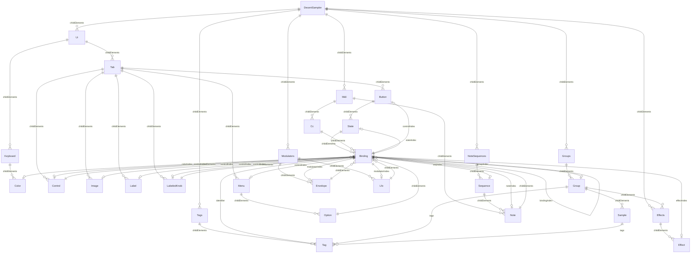

# DecentEditor

Editor for DecentSampler preset files.

**Info:**
This project is early in the development stage and this is not a working version yet.

## Entity Relationship Diagrams

```mermaid
erDiagram
    DecentSampler ||--o{ Ui : childElements
    DecentSampler ||--o{ Groups : childElements
    DecentSampler ||--o{ Effects : childElements
    DecentSampler ||--o{ Midi : childElements
    DecentSampler ||--o{ NoteSequences : childElements
    DecentSampler ||--o{ Modulators : childElements
    DecentSampler ||--o{ Tags : childElements

    Ui ||--o{ Keyboard : childElements
    Ui ||--o{ Tab : childElements

    Keyboard ||--o{ Color : childElements

    Tab ||--o{ Button : childElements
    Tab ||--o{ Control : childElements
    Tab ||--o{ Image : childElements
    Tab ||--o{ Label : childElements
    Tab ||--o{ LabeledKnob : childElements
    Tab ||--o{ Menu : childElements

    Button ||--o{ State : childElements

    State ||--o{ Binding : childElements

    Control ||--o{ Binding : childElements

    LabeledKnob ||--o{ Binding : childElements

    Menu ||--o{ Option : childElements

    Option ||--o{ Binding : childElements

    Groups ||--o{ Group : childElements

    Group ||--o{ Effects : childElements

    Effects ||--o{ Effect : childElements

    Group ||--o{ Sample : childElements

    Midi ||--o{ Cc : childElements
    Midi ||--o{ Note : childElements

    Cc ||--o{ Binding : childElements

    Note ||--o{ Binding : childElements

    NoteSequences ||--o{ Sequence : childElements

    Sequence ||--o{ Note : childElements

    Modulators ||--o{ Envelope : childElements
    Modulators ||--o{ Lfo : childElements

    Envelope ||--o{ Binding : childElements

    Lfo ||--o{ Binding : childElements

    Tags ||--o{ Tag : childElements

    Binding ||--o| Binding : bindingIndex
    Binding ||--o| Button : controlIndex
    Binding ||--o| Control : controlIndex
    Binding ||--o| Image : controlIndex
    Binding ||--o| Label : controlIndex
    Binding ||--o| LabeledKnob : controlIndex
    Binding ||--o| Menu : controlIndex
    Binding ||--o| Color : colorIndex
    Binding ||--o| Group : groupIndex
    Binding ||--o| Effect : effectIndex
    Binding ||--o| Envelope : modulatorIndex
    Binding ||--o| Lfo : modulatorIndex
    Binding ||--o| Note : noteIndex
    Binding ||--o| Sequence : seqIndex
    Binding ||--o| State : stateIndex
    Binding ||--o| Tag : identifier

    Group ||--o{ Tag : tags
    Sample ||--o{ Tag : tags
```
